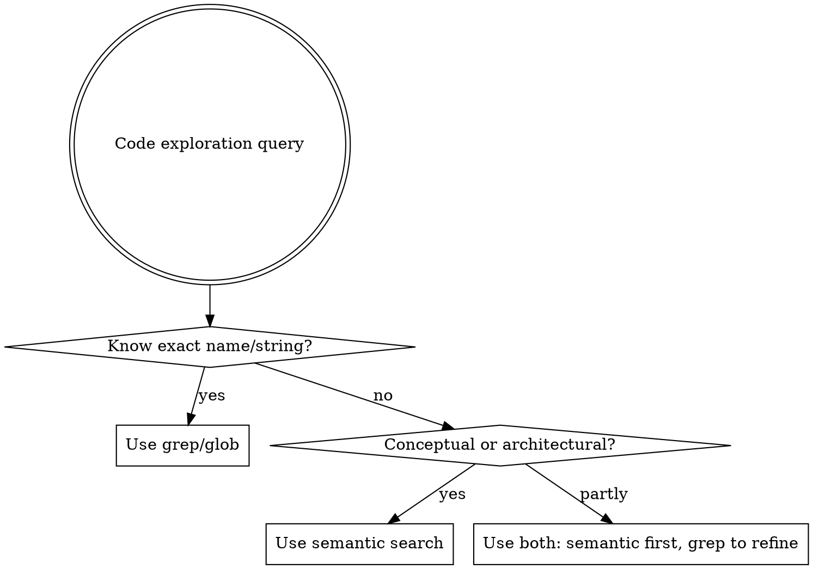

# Qdrant Semantic Code Search

Use the Qdrant MCP tools (`qdrant-code_*`) for semantic code search. Agents default to grep/glob for everything — semantic search is dramatically better for conceptual queries (37x faster, 84% fewer steps in benchmarks vs grep on large codebases).

## When to Use This Skill



### Semantic search wins for:

- Conceptual questions: "How does the push path work?", "Where do we handle retries?"
- Finding code by intent: "authentication middleware", "error propagation logic"
- Cross-cutting concerns: logging, error handling, middleware spanning many files
- Unknown names: user says "rate limiting" but code uses `throttle` or `backpressure`
- Exploring unfamiliar code: understanding a subsystem without knowing file structure
- Finding patterns: "examples of integration tests", "how we write API handlers"

### Grep/glob wins for:

- Exact symbol lookups: `PushRequest`, `type Ingester struct`
- Known function/type definitions: `func NewDistributor`
- Known filenames: `*_test.go`, `Makefile`
- Import tracing: who imports package X
- Literal strings: error messages, log lines, TODOs

### Combine both when:

- Semantic to find the area, then grep for specifics
- Semantic for "how does push path work" then grep for struct/function names from results

## Pre-Flight: Check Index Status

Before searching, always verify the codebase is indexed:

```
qdrant-code_get_index_status(path="/path/to/repo")
```

- **Not indexed**: Run `qdrant-code_index_codebase(path="/path/to/repo")` first
- **Indexed but stale** (>7 days since last index): Suggest `qdrant-code_reindex_changes(path="/path/to/repo")`
- **Indexed and fresh**: Proceed to search

## Tool Selection

| Goal | Tool | When |
|------|------|------|
| Find code by concept | `search_code` | Default for most code exploration |
| Find past fixes/changes | `search_git_history` | "How was this bug fixed before?", "When did X change?" |
| Code + git combined | `contextual_search` | Understanding code evolution, linking code to commits |
| Search multiple repos | `federated_search` | Cross-repo patterns, shared library usage |

## Query Crafting

Semantic search uses natural language embeddings. Write queries as descriptions of intent, not identifier names.

| Bad query (identifier-style) | Good query (natural language) |
|-----|------|
| `db pool` | `database connection pooling and lifecycle management` |
| `auth` | `authentication middleware that validates user tokens` |
| `retry` | `retry logic with backoff for failed requests` |
| `NewRing` | `hash ring initialization and consistent hashing setup` |

### Use filters to narrow scope

```
search_code(path="...", query="error handling for gRPC calls", fileTypes=[".go"], pathPattern="pkg/distributor/**")
```

- `fileTypes`: Limit to specific languages (e.g., `[".go"]`, `[".ts", ".tsx"]`)
- `pathPattern`: Limit to specific directories (e.g., `"src/services/**"`)

## Git History Search

Use `search_git_history` when the question is about change history, not current code:

- "How was this race condition fixed before?"
- "When did the API change from v1 to v2?"
- "What commits touched the authentication module recently?"

Requires indexing first: `qdrant-code_index_git_history(path="/path/to/repo")`

Incremental updates: `qdrant-code_index_new_commits(path="/path/to/repo")`

## Workflow

1. **Evaluate query** — semantic, grep, or both?
2. **Check index** — `get_index_status`, index/reindex if needed
3. **Craft natural language query** — describe intent, not identifiers
4. **Apply filters** — `fileTypes`, `pathPattern` when you know the area
5. **Search** — use appropriate tool from the table above
6. **Refine** — follow up with grep/glob on specific names from results

## Common Mistakes

| Mistake | Fix |
|---------|-----|
| Using identifier names as queries | Write natural language describing the concept |
| Searching unindexed codebase | Always check `get_index_status` first |
| Never using git history search | Use `search_git_history` for "how/when/why did X change" |
| Ignoring filters | Use `fileTypes` and `pathPattern` to improve relevance |
| Only using grep for everything | Evaluate whether semantic search fits the query type |
| Forgetting `contextual_search` | Use it when you need code + commit correlation |
